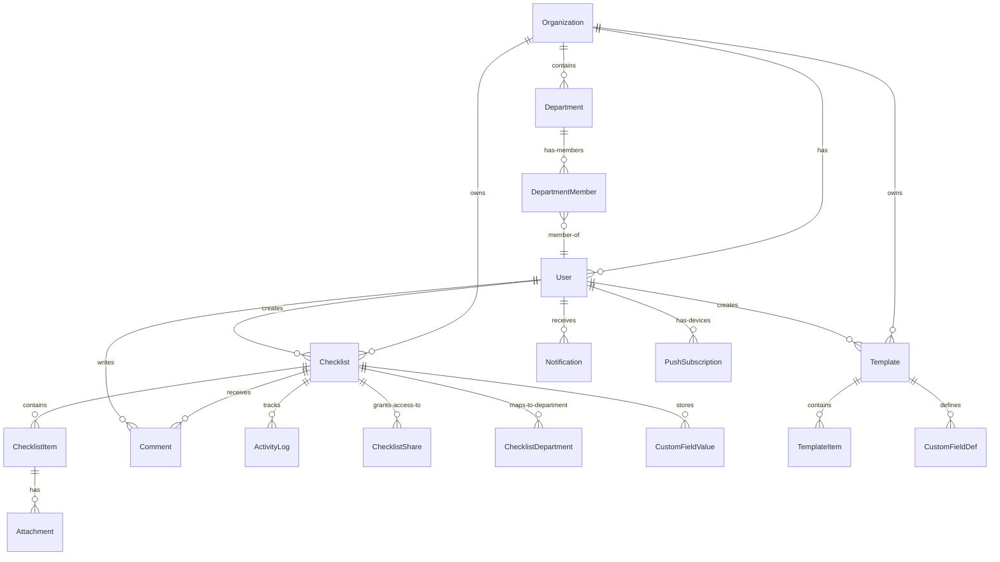

# Lists Manager — Code Review Summary

## 1. Application Overview

**Lists Manager** is a full-stack, multi-tenant checklist management application built for team collaboration on a Synology NAS. It enables users to create reusable checklist templates, spawn working instances from them, manage recurring schedules, and track completion with full audit trails.

---

## 2. Architecture & Tech Stack

| Layer | Technology |
|---|---|
| Framework | Next.js 16.2.4 (App Router, standalone output) |
| Language | TypeScript 5.x |
| Database | SQLite (via better-sqlite3 + Prisma 7.7.0 adapter) |
| Auth | NextAuth v5 (JWT strategy, credentials provider, bcrypt) |
| Styling | Tailwind CSS 4 + clsx/tailwind-merge |
| ORM | Prisma 7 |
| Date/Time | Luxon (Australia/Sydney timezone) |
| Testing | Vitest 4.1.4 |
| Deployment | Docker multi-stage, Cloudflare Tunnel, Synology NAS |
| Notifications | In-app notifications + Web Push (VAPID) |
| Email | Nodemailer (SMTP config stored in DB) |

### Key Patterns
- **Multi-tenant isolation**: Every user belongs to an `Organization`. All queries are scoped to `organizationId`. No cross-tenant visibility.
- **Server Components + Client Pages**: Async server pages fetch data, then delegate to client components (`DashboardClient`, `ChecklistDetailClient`, etc.).
- **Fire-and-forget side effects**: Activity logging, push notifications, and comments use `.catch(() => undefined)` so failures never break the primary request.
- **Zod validation**: All API routes validate input with Zod schemas.
- **RBAC**: Three roles — `admin`, `manager`, `member`. Access control is enforced via [`access.ts`](src/lib/access.ts) helper functions.

---

## 3. Data Model (14 Models)



### Core Entities
- **[`Organization`](prisma/schema.prisma:14)**: Tenant boundary with invite codes. First org is `isPrimary` for instance-level settings.
- **[`Department`](prisma/schema.prisma:33)**: Groups within an org for "department" visibility scoping.
- **[`Template`](prisma/schema.prisma:114)**: Master checklist definitions with items, custom fields, and recurrence. Versioned on edit.
- **[`Checklist`](prisma/schema.prisma:158)**: Working instance. Can be linked to a template (with snapshot of `version`). Supports team/department/private visibility.
- **[`ChecklistItem`](prisma/schema.prisma:244)**: Individual tasks with assignee, priority, due date, notes, and attachments.
- **[`ActivityLog`](prisma/schema.prisma:217)**: Audit trail with denormalized actor name (survives user deletion).
- **[`Comment`](prisma/schema.prisma:203)**: Conversation thread on checklists.
- **[`Notification`](prisma/schema.prisma:286)**: In-app notification store.
- **[`PushSubscription`](prisma/schema.prisma:96)**: Web Push device registrations.
- **[`AppSetting`](prisma/schema.prisma:108)**: Key/value store for SMTP, VAPID keys, etc. Secrets in DB, not .env.

---

## 4. Feature Summary

### Implemented Features
| Feature | Details |
|---|---|
| **Templates** | CRUD with items, priorities, custom fields (text/dropdown/user), categories, recurrence, archiving |
| **Checklists** | From template or ad-hoc, with due dates, priorities, assignees, notes, attachments (10MB cap) |
| **Recurrence** | Auto-spawn on completion (Notion-style). Supports: daily, weekly, fortnightly, monthly, quarterly, yearly |
| **Run Again / Reset** | One-off lists can be re-run with new due date; Reset unchecks items in-place |
| **Visibility** | Team (everyone), Department (members only), Private (creator + shared) |
| **Sharing** | Per-checklist user sharing for private lists |
| **Comments** | Conversation thread on checklists |
| **Activity Log** | Full audit trail of all checklist changes |
| **Push Notifications** | Web Push API with VAPID, service worker with notification click handling |
| **Email** | Password reset via Nodemailer, SMTP config in DB |
| **Reports** | Completion stats, per-user metrics, per-category breakdown, trend chart data |
| **Export** | CSV export of checklists, JSON export/import of templates |
| **Multi-org** | Registration creates/joins organizations |
| **Departments** | Admin-managed groups for visibility scoping |
| **Cloudflare Tunnel** | Built-in tunnel management with health monitoring |
| **Backup** | Daily DB backup via cron, last 14 kept |
| **PWA** | Installable via manifest, service worker for push |
| **Dark/Iris Theme** | Theme persistence in localStorage |
| **Help System** | Context-sensitive help per page |
| **Self-hosted** | Docker deployment on Synology NAS |

---

## 5. Code Quality Assessment

### Strengths
1. **Clean separation of concerns**: Business logic in `src/lib/`, UI in `src/components/`, routing in `src/app/`.
2. **Strong type safety**: Comprehensive TypeScript usage with proper types in [`types.ts`](src/lib/types.ts).
3. **Input validation**: All API routes use Zod schemas.
4. **Security awareness**:
   - Password hashing with bcrypt (cost 12)
   - Timing-safe secret comparison for cron endpoints
   - Cross-org guardrails on assignee/department validation
   - Path traversal protection in [`attachmentFilePath()`](src/lib/attachments.ts:21)
   - CSV formula injection prevention in [`csvCell()`](src/app/api/checklists/export/route.ts:11)
5. **Graceful degradation**: Fire-and-forget patterns for non-critical operations (activity log, push, comments).
6. **Good testing foundation**: Vitest setup with [`recurrence.test.ts`](src/lib/__tests__/recurrence.test.ts).
7. **Well-documented**: README covers deployment, features, and stack. Schema has inline comments.
8. **Smart recurrence logic**: [`computeNextDueDate()`](src/lib/recurrence.ts:28) anchors to current due date and advances until future.

### Areas for Improvement

#### A. Missing Input Validation
- [`patchSchema`](src/app/api/checklists/[id]/route.ts:28) doesn't validate `description` max length consistently (uses `.max(2000)` but no `.trim()` in some places).
- [`createChecklistFromTemplate()`](src/lib/checklist-helpers.ts:33) accepts `title` as optional but falls back to template title — no explicit validation.
- Custom field value length is limited to 2000 in [`patchSchema`](src/app/api/checklists/[id]/route.ts:41), but no validation on the field name length.

#### B. Performance Concerns
- No indexing on frequently queried fields beyond what Prisma generates. The [`Comment`](prisma/schema.prisma:212) model has an index on `(checklistId, createdAt)` but `ActivityLog` has the same — good. However, `Notification` lacks an index on `(userId, read)`.
- [`DashboardClient.load()`](src/components/DashboardClient.tsx:38) fetches all checklists, templates, and users in one call — could become slow with hundreds of checklists.
- Polling every 20 seconds in [`ChecklistDetailClient`](src/components/ChecklistDetailClient.tsx:83) for real-time updates is a basic approach. Consider Server-Sent Events (SSE) or WebSocket for collaborative environments.

#### C. Error Handling
- Many `.catch(() => undefined)` swallow errors silently. While fine for fire-and-forget, consider structured logging (even if just to a file) for debugging.
- No global error boundary in the client components — a component crash leaves the user with a blank page.

#### D. Security
- Registration is always open (`GET /api/register` always returns `{open: true}`). The README says "open only while zero users exist" but the code shows `return NextResponse.json({ open: true })` unconditionally. This is a discrepancy.
- No rate limiting on login or password reset endpoints.
- No CSRF protection beyond NextAuth's built-in tokens (acceptable for JWT strategy, but worth noting).
- VAPID public key in [`webpush.ts`](src/lib/webpush.ts:6) has a hardcoded email — consider making it configurable.

#### E. Data Integrity
- No database constraints (CHECK, UNIQUE beyond what Prisma handles) for enum fields like `role`, `status`, `visibility`, `priority`, `recurrence`. Values like `"high"` could technically be stored as `"HIGH"` or invalid strings.
- `CustomFieldValue.value` has no max length constraint in the database schema (only in the API schema).

---

## 6. Recommendations: Next-Level Features

### Priority 1 — High Impact, Moderate Effort

#### 6.1 Real-Time Collaboration
**Problem**: The 20-second polling in [`ChecklistDetailClient`](src/components/ChecklistDetailClient.tsx:83) is inefficient and doesn't provide true real-time updates.
**Solution**: Implement Server-Sent Events (SSE) or use Next.js `fetch` with `cache: 'no-store'` for live updates. When a checklist item is checked by user A, user B sees it instantly.
**Implementation**:
- Add `/api/checklists/[id]/subscribe` SSE endpoint
- Broadcast checklist updates via a simple in-memory channel (or Redis for multi-instance)
- Client subscribes when viewing a checklist

#### 6.2 Database Indexing & Query Optimization
**Problem**: As data grows, queries on `Notification.userId`, `Checklist.status + organizationId`, and `ChecklistItem.checked + checklistId` will slow down.
**Solution**: Add strategic indexes.
```prisma
model Notification {
  // ... existing fields
  @@index([userId, read])
  @@index([createdAt])
}

model Checklist {
  // ... existing fields
  @@index([organizationId, status])
  @@index([organizationId, dueDate])
  @@index([assignedToId])
}

model ChecklistItem {
  // ... existing fields
  @@index([checklistId, checked])
  @@index([assignedToId])
}
```

#### 6.3 Search & Filtering Enhancements
**Problem**: Current search is title-only with basic `contains` matching.
**Solution**: Add full-text search capability.
- Search across checklist titles, item texts, comments, and notes
- Add filter by date range, status, priority, and custom fields
- Implement debounced search input in the dashboard

#### 6.4 Unit Test Coverage
**Problem**: Only [`recurrence.test.ts`](src/lib/__tests__/recurrence.test.ts) exists.
**Solution**: Add tests for:
- [`computeNextDueDate()`](src/lib/recurrence.ts:28) edge cases (month boundaries, leap years)
- Access control logic in [`access.ts`](src/lib/access.ts)
- Checklist creation flow (template vs ad-hoc)
- Export formatting (CSV escaping)

### Priority 2 — Medium Impact, Moderate Effort

#### 6.5 Subtasks / Nested Checklists
**Feature**: Allow checklist items to have their own sub-items, creating hierarchical checklists.
**Schema addition**:
```prisma
model ChecklistItem {
  // ... existing
  parentId String?
  parent   ChecklistItem? @relation("SubtaskHierarchy", fields: [parentId], references: [id], onDelete: Cascade)
  subtasks ChecklistItem[] @relation("SubtaskHierarchy")
}
```
**UI**: Expand/collapse animation on items with subtasks.

#### 6.6 Checklist Templates Import from External Sources
**Feature**: Import templates from Notion, Trello, or CSV.
**Implementation**: Add `/api/templates/import/csv` and `/api/templates/import/notion` endpoints. Parse common formats and create template records.

#### 6.7 Scheduled Reminders (Beyond Overdue Digest)
**Feature**: Allow users to set custom reminders (e.g., "Remind me 2 days before due date").
**Implementation**:
- Add `Reminder` model with `scheduledAt`, `userId`, `checklistId`
- Extend the scheduler to process upcoming reminders
- Support notification channels: in-app, push, email

#### 6.8 Bulk Operations
**Feature**: Select multiple checklists and perform bulk actions:
- Change assignee
- Change priority
- Change due date
- Mark as completed
- Delete
**Implementation**: Add `/api/checklists/bulk` endpoint accepting an array of IDs and an action.

#### 6.9 Checklist Dependencies / Blocking Relations
**Feature**: Link checklists so that Checklist B cannot start until Checklist A is completed.
**Schema addition**:
```prisma
model ChecklistDependency {
  id           String  @id @default(cuid())
  dependentId  String
  dependent    Checklist @relation(fields: [dependentId], references: [id], onDelete: Cascade)
  prerequisiteId String
  prerequisite Checklist @relation(fields: [prerequisiteId], references: [id], onDelete: Cascade)
  
  @@unique([dependentId, prerequisiteId])
}
```

### Priority 3 — Advanced Features

#### 7.0 Integration Webhooks
**Feature**: Outgoing webhooks when events occur (checklist created, completed, item checked).
**Implementation**:
- Add `Webhook` model with URL, secret, enabled events
- Trigger HTTP POST on events
- Log webhook delivery attempts with retry logic

#### 7.1 Analytics Dashboard
**Feature**: Visual charts for completion trends, team performance, average time to complete.
**Implementation**: Use the existing reports API data but add a charting library (e.g., Recharts) to the `/reports` page.

#### 7.2 Mobile-Optimized Responsive UI
**Feature**: Improve mobile experience with touch-friendly controls, bottom navigation, swipe gestures.
**Implementation**: Review and enhance responsive breakpoints, add swipe-to-complete for mobile checklist items.

#### 7.3 Audit Trail Export
**Feature**: Export activity logs for compliance/auditing purposes.
**Implementation**: Add `/api/checklists/[id]/activity/export` endpoint returning CSV of all activity.

#### 7.4 Two-Factor Authentication (2FA)
**Feature**: TOTP-based 2FA for admin accounts.
**Implementation**: Add `totpSecret` to User model, verify during login flow.

#### 7.5 API Keys for Programmatic Access
**Feature**: Allow users to generate API keys for integrations.
**Schema addition**:
```prisma
model ApiKey {
  id        String   @id @default(cuid())
  userId    String
  user      User     @relation(fields: [userId], references: [id], onDelete: Cascade)
  keyHash   String   @unique
  name      String
  expiresAt DateTime?
  createdAt DateTime @default(now())
}
```

---

## 7. Infrastructure Recommendations

### 7.6 Migration to PostgreSQL
**Current**: SQLite is simple and works well for single-user/small team deployments.
**Future**: If scaling to larger teams or multiple concurrent writers, consider PostgreSQL via Prisma's PostgreSQL provider. This enables:
- Better concurrent write handling
- Full-text search
- More robust backup/restore
- Connection pooling for higher traffic

### 7.7 Health Check Enhancement
The [`/api/health`](src/app/api/health/route.ts) endpoint exists but could include:
- Database connectivity check
- Attachment storage space check
- Service dependency status (SMTP, Push)

### 7.8 Monitoring & Alerting
Add application performance monitoring:
- Request latency tracking
- Error rate monitoring
- Database connection pool metrics

---

## 8. Summary Scorecard

| Category | Rating | Notes |
|---|---|---|
| Architecture | 9/10 | Clean separation, good multi-tenant design |
| Type Safety | 9/10 | Comprehensive TypeScript usage |
| Security | 7/10 | Good basics, missing rate limiting, registration discrepancy |
| Test Coverage | 4/10 | Only one test file |
| Performance | 7/10 | Basic but functional, needs indexing at scale |
| UX | 8/10 | Good feature set, context-sensitive help |
| Documentation | 8/10 | Good README and inline comments |
| Error Handling | 7/10 | Graceful degradation, but silent failures |
| Code Quality | 8/10 | Clean, readable, consistent patterns |
| **Overall** | **7.6/10** | Solid production application with room for enhancement |

---

## 9. Quick Wins (Low Effort, High Impact)

1. **Fix registration open/close logic** — align code with README documentation
2. **Add database indexes** — immediate query performance improvement
3. **Add structured logging** — replace silent `.catch(() => undefined)` with file-based logging
4. **Increase test coverage** — add tests for core business logic
5. **Add search debounce** — improve dashboard search UX
6. **Add loading skeletons** — replace "Loading..." text with skeleton screens
7. **Add keyboard shortcuts** — e.g., `?` for help, `n` for new checklist
8. **Validate enum fields at DB level** — add CHECK constraints for data integrity
